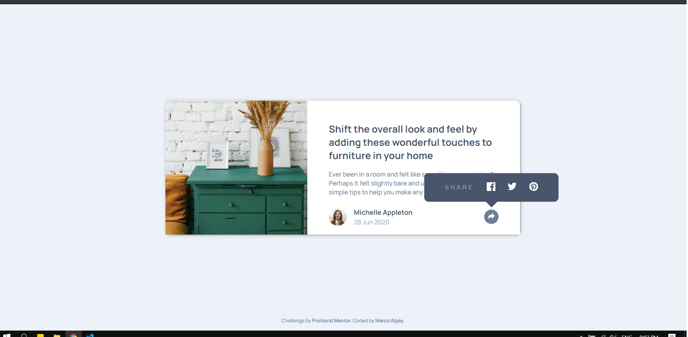
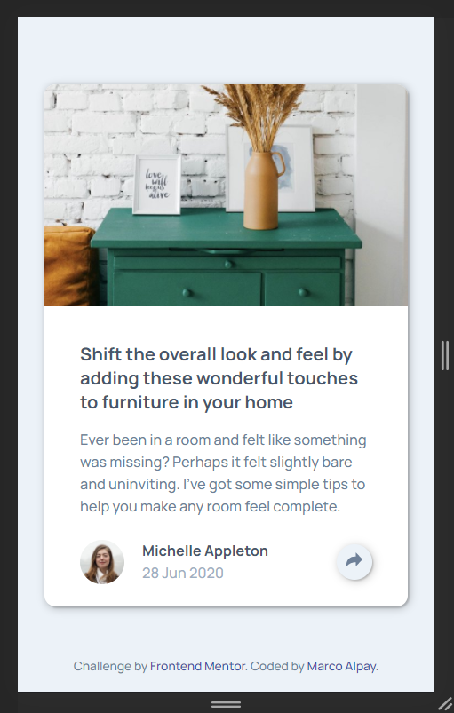

# Frontend Mentor - Article preview component solution

This is a solution to the [Article preview component challenge on Frontend Mentor](https://www.frontendmentor.io/challenges/article-preview-component-dYBN_pYFT). Frontend Mentor challenges help you improve your coding skills by building realistic projects.

## Table of contents

- [Overview](#overview)
  - [The challenge](#the-challenge)
  - [Screenshot](#screenshot)
  - [Links](#links)
- [My process](#my-process)
  - [Built with](#built-with)
  - [What I learned](#what-i-learned)
- [Author](#author)

## Overview

### The challenge

Users should be able to:

- View the optimal layout for the component depending on their device's screen size
- See the social media share links when they click the share icon

### Screenshot




### Links

- Solution URL: [https://www.frontendmentor.io/solutions/article-preview-using-sass-and-javascript-sAMWEZYTe](https://www.frontendmentor.io/solutions/article-preview-using-sass-and-javascript-sAMWEZYTe)
- Live Site URL: [https://devmarco02-article-preview.netlify.app/](https://devmarco02-article-preview.netlify.app/)

## My process

### Built with

- Semantic HTML5 markup
- Sass
- JavaScript
- Flexbox
- CSS Grid
- Mobile-first workflow

### What I learned

I have learned how to make a custom share links.

```js
const init = () => {
  const img = document.createElement("img");
  img.src = "./images/drawers.jpg";

  const postUrl = encodeURI(document.location.href);
  const postTitle = encodeURI("Hi everyone, please check this out: ");
  const drawerImg = img.src;

  facebook.setAttribute(
    "href",
    `https://www.facebook.com/sharer.php?u=${postUrl}`
  );

  twitter.setAttribute(
    "href",
    `https://twitter.com/share?url=${postUrl}&text=${postTitle}`
  );

  pinterest.setAttribute(
    "href",
    `https://pinterest.com/pin/create/bookmarklet/?media=${drawerImg}&url=${postUrl}&description=${postTitle}`
  );
};
```

## Author

- Frontend Mentor - [@devMarco02](https://www.frontendmentor.io/profile/devMarco02)
